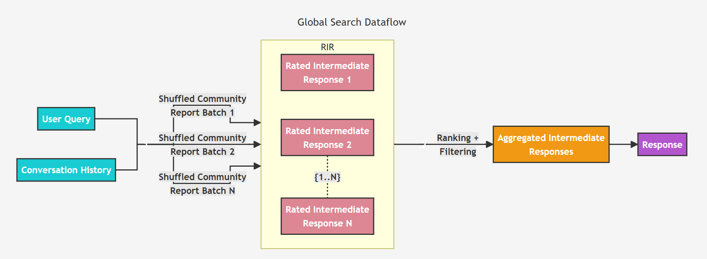
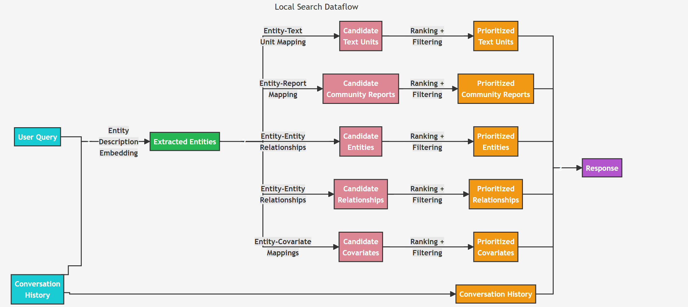
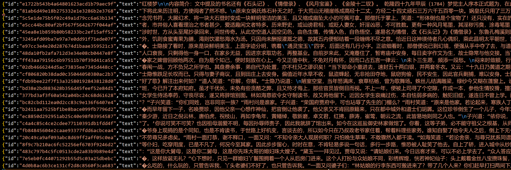

# GraphRAG_数据案例\_红楼梦

## 1.Workflow

### index building


>Document - 输入系统的文档。这些文档可以是CSV中的单行或单个.txt文件。
>
>TextUnit - 分析的文本块。这些文本块的大小、重叠以及是否遵循任何数据边界可以在下面配置。一个常见的用例是设置成文档和TextUnit之间存在一对多的关系，而不是多对多。 
>
>Entity - 从TextUnit中提取的实体。这些实体可以表示人员、地点、事件或您提供的其他实体模型。 Relationship - 两个实体之间的关系。这些关系是从协变量中生成的。 
>
>Covariate - 提取的声明信息，包含关于实体的可能有时间限制的陈述。 
>
>Community Report - 一旦生成实体，我们对它们执行分层社区检测，并为该层次结构中的每个社区生成报告。 
>
>Node - 此表包含嵌入和聚类的实体和文档的渲染图视图的布局信息。

### Global_search



### local_search



## 2.Output_file

### Relationships


```json
{"source":""甄士隐"","target":""宝玉"","weight":1,"description":""甄士隐与宝玉有直接的交集，甄士隐对宝玉的过去和未来有先知之见."","text_unit_ids":["e98cb38de9f68281b76abc8c25fdf027"],"id":"a5968d7f52b54f12a8dcf3e4117f06a0","human_readable_id":"29","source_degree":17,"target_degree":415,"rank":432}

{"source":""甄士隐"","target":""京城"","weight":1,"description":""甄士隐与京城有间接的联系，通过与贾雨村的对话和宝玉的活动."","text_unit_ids":["e98cb38de9f68281b76abc8c25fdf027"],"id":"c298686adb784e3cb1537008efc98786","human_readable_id":"30","source_degree":17,"target_degree":6,"rank":23}

{"source":""甄士隐"","target":""仁清巷"","weight":1,"description":""甄士隐与仁清巷有直接的联系，仁清巷是甄士隐与贾雨村旧宅的地点."","text_unit_ids":["e98cb38de9f68281b76abc8c25fdf027"],"id":"16c45fda50344dcb96488e01a433f1c0","human_readable_id":"31","source_degree":17,"target_degree":1,"rank":18}

{"source":""贾雨村"","target":""冷子兴"","weight":2,"description":"In the village of 賽雷村, a conversation takes place between 賽雷村 and 冷子芩. 冷子芩 offers advice on 賽雷村's political situation, demonstrating a deep understanding of the village's circumstances. This exchange reveals a connection between the two, as 冷子芩 elaborates on the situation in 賽雷村, linking it to events in the stone capital, indicating a broader context to the issues at hand.","text_unit_ids":["5c5e1de75b5f02c49a1d79cc6a63b134","fb84845604e2caae93377fdd6acbcea4"],"id":"9316a90b78734130a3d41c7ab25e7567","human_readable_id":"32","source_degree":31,"target_degree":6,"rank":37}

{"source":""贾雨村"","target":""贾府"","weight":1,"description":""贾雨村后来成为官员，与贾府有直接关联，与石头的故事有直接关联."","text_unit_ids":["5c5e1de75b5f02c49a1d79cc6a63b134"],"id":"40cde071b37143cdb945033ed715b0bf","human_readable_id":"33","source_degree":31,"target_degree":90,"rank":121}

{"source":""贾雨村"","target":""《石头记》"","weight":4,"description":""贾雨村's rise from a poor scholar to a high-ranking official is a significant subplot in 《石头记》."","text_unit_ids":["7b0ca44234af284c5ff099d72d38d9fd","ad0211462574b436ec04fbd02a16d928","b2411aa7525bf1be8bace099fb7796d2","e5cc44bc80af2bf567f5642677f044af"],"id":"d069073a70ec41bc949ee6e61ae8edf9","human_readable_id":"34","source_degree":31,"target_degree":5,"rank":36}
 
{"source":""贾雨村"","target":""士隐"","weight":2,"description":"In the narrative provided, two entities are highlighted: "贾雨村" and "士隐". "贾雨村" is described as a poor scholar who resides in a temple that is situated adjacent to "士隐's" house. The relationship between "士隐" and "贾雨村" is characterized by a social connection, where "士隐" frequently visits "贾雨村". This interaction is not merely casual, as "士隐" often extends an invitation to "贾雨村", requesting his presence in his study for meals. This indicates a deeper bond and mutual respect between the two, transcending mere social acquaintance.","text_unit_ids":["48da10fb2afa712d3e34e08cb0447e8f","e97cc3e4e20d287674d1baae359521c3"],"id":"eb019f5637d34b0fb276a4e47fa9d3f8","human_readable_id":"35","source_degree":31,"target_degree":27,"rank":58}
 
{"source":""贾雨村"","target":""甄家"","weight":1,"description":""贾雨村与甄家的丫鬟有短暂的交集，他对甄家丫鬟产生了好感，认为她是风尘中的知己."","text_unit_ids":["48da10fb2afa712d3e34e08cb0447e8f"],"id":"7eea770917f84fb289ddac8d64095263","human_readable_id":"36","source_degree":31,"target_degree":14,"rank":45}

```

### Community_reports


```json
{"community":"282","full_content":"# 史湘云与贾府社交圈\n\n史湘云是《红楼梦》中一个充满活力和诗意的角色，与贾宝玉、薛宝钗等关键人物有着密切的联系。她与贾府的社交圈互动频繁，参与各种活动，如诗歌社团、经济讨论等，展现了她多才多艺和社交能力。史湘云与贾宝玉之间的关系尤为丰富，包括共同的文学活动、经济话题讨论和潜在的浪漫情节。她还与贾母、王夫人、林黛玉等家族成员有着深厚的情感纽带。\n\n## 史湘云与贾宝玉的深厚友谊\n\n史湘云与贾宝玉之间的关系丰富而复杂，他们不仅是表亲，还共享着深厚的友谊。他们经常在一起享受彼此的陪伴，进行愉快的交谈和礼物交换，这表明了他们之间紧密的社交联系。史湘云是宝瑶社交圈中的一员，他们之间的互动和共同经历进一步加深了这种联系。史湘云对宝瑶的行动观察并作出反应，这体现了他们共享的体验和互动。[Data: Relationships (1097, 133, 1024, 2527, 2528, +more)]\n\n## 史湘云与贾府家族成员的互动\n\n史湘云与贾府的家族成员，如贾母、王夫人、林黛玉等，有着深厚的情感纽带。她被贾母关怀，与王夫人有互动，是林黛玉社交圈的一部分。这些关系体现了家族内部的亲情、尊重和相互理解。[Data: Relationships (213, 2142, 2284, 133, 2532, +more)]\n\n## 史湘云的社交活动与才华展现\n\n史湘云积极参与贾府的社交活动，如诗歌社团、经济讨论等，展现了她的多才多艺和社交能力。她提议成立海棠社，计划组织活动，表明她对海棠社的创立有直接的推动作用。[Data: Relationships (2535, 2534, 2536, 2537, 2530, +more)]\n\n## 史湘云与家族成员的礼物交换\n\n史湘云与家族成员之间的礼物交换体现了他们之间的亲密关系和社会联系。她为贾宝玉、金钏儿、翠缕等人带来礼物，这不仅体现了他们之间的社会联系，也反映了通过礼物交换来加深彼此情感的习俗。[Data: Relationships (1097, 2529, 2531, 2530, 2528, +more)]\n\n## 史湘云的家族角色与情感纽带\n\n史湘云在家族中扮演着重要角色，她与贾母、王夫人、林黛玉等家族成员有着深厚的情感纽带。她对贾母的关怀、与王夫人的互动、以及与林黛玉的亲密关系，都体现了家族内部的亲情、尊重和相互理解。[Data: Relationships (213, 2142, 2284, 133, 2532, +more)]","level":5,"rank":7.5,"title":"史湘云与贾府社交圈","rank_explanation":"高影响力评级反映了史湘云在贾府社交圈中的核心地位，以及她与多个关键人物之间的复杂关系，这些关系对故事的进展和家族动态有重大影响。","summary":"史湘云是《红楼梦》中一个充满活力和诗意的角色，与贾宝玉、薛宝钗等关键人物有着密切的联系。她与贾府的社交圈互动频繁，参与各种活动，如诗歌社团、经济讨论等，展现了她多才多艺和社交能力。史湘云与贾宝玉之间的关系尤为丰富，包括共同的文学活动、经济话题讨论和潜在的浪漫情节。她还与贾母、王夫人、林黛玉等家族成员有着深厚的情感纽带。","findings":[{"explanation":"史湘云与贾宝玉之间的关系丰富而复杂，他们不仅是表亲，还共享着深厚的友谊。他们经常在一起享受彼此的陪伴，进行愉快的交谈和礼物交换，这表明了他们之间紧密的社交联系。史湘云是宝瑶社交圈中的一员，他们之间的互动和共同经历进一步加深了这种联系。史湘云对宝瑶的行动观察并作出反应，这体现了他们共享的体验和互动。[Data: Relationships (1097, 133, 1024, 2527, 2528, +more)]","summary":"史湘云与贾宝玉的深厚友谊"},{"explanation":"史湘云与贾府的家族成员，如贾母、王夫人、林黛玉等，有着深厚的情感纽带。她被贾母关怀，与王夫人有互动，是林黛玉社交圈的一部分。这些关系体现了家族内部的亲情、尊重和相互理解。[Data: Relationships (213, 2142, 2284, 133, 2532, +more)]","summary":"史湘云与贾府家族成员的互动"},{"explanation":"史湘云积极参与贾府的社交活动，如诗歌社团、经济讨论等，展现了她的多才多艺和社交能力。她提议成立海棠社，计划组织活动，表明她对海棠社的创立有直接的推动作用。[Data: Relationships (2535, 2534, 2536, 2537, 2530, +more)]","summary":"史湘云的社交活动与才华展现"},{"explanation":"史湘云与家族成员之间的礼物交换体现了他们之间的亲密关系和社会联系。她为贾宝玉、金钏儿、翠缕等人带来礼物，这不仅体现了他们之间的社会联系，也反映了通过礼物交换来加深彼此情感的习俗。[Data: Relationships (1097, 2529, 2531, 2530, 2528, +more)]","summary":"史湘云与家族成员的礼物交换"},{"explanation":"史湘云在家族中扮演着重要角色，她与贾母、王夫人、林黛玉等家族成员有着深厚的情感纽带。她对贾母的关怀、与王夫人的互动、以及与林黛玉的亲密关系，都体现了家族内部的亲情、尊重和相互理解。[Data: Relationships (213, 2142, 2284, 133, 2532, +more)]","summary":"史湘云的家族角色与情感纽带"}],"full_content_json":"{\n    "title": "史湘云与贾府社交圈",\n    "summary": "史湘云是《红楼梦》中一个充满活力和诗意的角色，与贾宝玉、薛宝钗等关键人物有着密切的联系。她与贾府的社交圈互动频繁，参与各种活动，如诗歌社团、经济讨论等，展现了她多才多艺和社交能力。史湘云与贾宝玉之间的关系尤为丰富，包括共同的文学活动、经济话题讨论和潜在的浪漫情节。她还与贾母、王夫人、林黛玉等家族成员有着深厚的情感纽带。",\n    "rating": 7.5,\n    "rating_explanation": "高影响力评级反映了史湘云在贾府社交圈中的核心地位，以及她与多个关键人物之间的复杂关系，这些关系对故事的进展和家族动态有重大影响。",\n    "findings": [\n        {\n            "summary": "史湘云与贾宝玉的深厚友谊",\n            "explanation": "史湘云与贾宝玉之间的关系丰富而复杂，他们不仅是表亲，还共享着深厚的友谊。他们经常在一起享受彼此的陪伴，进行愉快的交谈和礼物交换，这表明了他们之间紧密的社交联系。史湘云是宝瑶社交圈中的一员，他们之间的互动和共同经历进一步加深了这种联系。史湘云对宝瑶的行动观察并作出反应，这体现了他们共享的体验和互动。[Data: Relationships (1097, 133, 1024, 2527, 2528, +more)]"\n        },\n        {\n            "summary": "史湘云与贾府家族成员的互动",\n            "explanation": "史湘云与贾府的家族成员，如贾母、王夫人、林黛玉等，有着深厚的情感纽带。她被贾母关怀，与王夫人有互动，是林黛玉社交圈的一部分。这些关系体现了家族内部的亲情、尊重和相互理解。[Data: Relationships (213, 2142, 2284, 133, 2532, +more)]"\n        },\n        {\n            "summary": "史湘云的社交活动与才华展现",\n            "explanation": "史湘云积极参与贾府的社交活动，如诗歌社团、经济讨论等，展现了她的多才多艺和社交能力。她提议成立海棠社，计划组织活动，表明她对海棠社的创立有直接的推动作用。[Data: Relationships (2535, 2534, 2536, 2537, 2530, +more)]"\n        },\n        {\n            "summary": "史湘云与家族成员的礼物交换",\n            "explanation": "史湘云与家族成员之间的礼物交换体现了他们之间的亲密关系和社会联系。她为贾宝玉、金钏儿、翠缕等人带来礼物，这不仅体现了他们之间的社会联系，也反映了通过礼物交换来加深彼此情感的习俗。[Data: Relationships (1097, 2529, 2531, 2530, 2528, +more)]"\n        },\n        {\n            "summary": "史湘云的家族角色与情感纽带",\n            "explanation": "史湘云在家族中扮演着重要角色，她与贾母、王夫人、林黛玉等家族成员有着深厚的情感纽带。她对贾母的关怀、与王夫人的互动、以及与林黛玉的亲密关系，都体现了家族内部的亲情、尊重和相互理解。[Data: Relationships (213, 2142, 2284, 133, 2532, +more)]"\n        }\n    ]\n}","id":"7e6770bf-5349-443a-bfd3-a65a01c85946"}

{"community":"281","full_content":"# The Dream of the Red Chamber Community\n\nThe community is centered around the Jia family, with Bao Yu as a key figure. Relationships within the community are complex, involving familial ties, romantic interests, and social dynamics. Bao Yu's interactions with various characters, including Xi Ren, Dai Yu, and Baochai, are significant, reflecting a range of emotions and responsibilities.\n\n## Bao Yu's Central Role\n\nBao Yu, known as "宝玉" in the narrative, is a central figure in the community, with complex relationships with other characters. His interactions with his father, Jia Zheng, are marked by tension and conflict, yet also show paternal concern [Data: Relationships (409)]. Bao Yu's relationship with his grandmother, Jia Mu, is one of deep affection and concern, with Jia Mu playing a significant role in his life [Data: Relationships (182)]. Bao Yu's interactions with Lady Feng, known as "凤姐", demonstrate her hospitality and care, as well as her directive role in the household [Data: Relationships (1125)].\n\n## Bao Yu's Romantic Interests\n\nBao Yu's romantic interests are a significant aspect of the community dynamics. His relationship with Dai Yu, known as "黛玉", is characterized by deep affection, poetry, and personal intimacy, with moments of conflict and emotional distress [Data: Relationships (1078)]. Bao Yu's relationship with Baochai, known as "宝钗", evolves from initial disinterest to a complex bond involving philosophical and moral discussions, leading to their eventual marriage [Data: Relationships (1077)].\n\n## Bao Yu's Caretakers and Servants\n\nBao Yu's caretakers and servants, such as Xi Ren, known as "袭人", play crucial roles in his life. Xi Ren is a loyal maidservant who assists Bao Yu in various tasks and is deeply involved in his daily activities, showing concern for his health and well-being [Data: Relationships (1087)]. Bao Yu's relationship with Ping'er, known as "平儿", is characterized by playful activities, mutual respect, and a level of trust that allows for open discussions [Data: Relationships (1086)].\n\n## Bao Yu's Siblings and Family Members\n\nBao Yu's relationships with his siblings and other family members are multifaceted. His sister Tan Chun, known as "探春", shares a close relationship with him, involving literary pursuits and playful activities [Data: Relationships (1080)]. Bao Yu's interactions with other family members, such as Jia Lian, known as "贾琏", and Jia Zhen, known as "贾珍", reflect social connections and familial duties [Data: Relationships (647, 1153)].\n\n## Bao Yu's Social Circle\n\nBao Yu's social circle includes various characters with whom he shares a range of relationships. His interactions with You Shi, known as "尤氏", and other family members during meals and after paying respects to the deceased, highlight his place within the familial structure [Data: Relationships (1123)]. Bao Yu's involvement in poetry societies and other social activities with his siblings and other relatives showcases his active participation in community life [Data: Relationships (1080)].","level":5,"rank":7.5,"title":"The Dream of the Red Chamber Community","rank_explanation":"The impact severity rating is high due to the intricate web of relationships and the potential for emotional and familial conflicts within the community.","summary":"The community is centered around the Jia family, with Bao Yu as a key figure. Relationships within the community are complex, involving familial ties, romantic interests, and social dynamics. Bao Yu's interactions with various characters, including Xi Ren, Dai Yu, and Baochai, are significant, reflecting a range of emotions and responsibilities.","findings":[{"explanation":"Bao Yu, known as "宝玉" in the narrative, is a central figure in the community, with complex relationships with other characters. His interactions with his father, Jia Zheng, are marked by tension and conflict, yet also show paternal concern [Data: Relationships (409)]. Bao Yu's relationship with his grandmother, Jia Mu, is one of deep affection and concern, with Jia Mu playing a significant role in his life [Data: Relationships (182)]. Bao Yu's interactions with Lady Feng, known as "凤姐", demonstrate her hospitality and care, as well as her directive role in the household [Data: Relationships (1125)].","summary":"Bao Yu's Central Role"},{"explanation":"Bao Yu's romantic interests are a significant aspect of the community dynamics. His relationship with Dai Yu, known as "黛玉", is characterized by deep affection, poetry, and personal intimacy, with moments of conflict and emotional distress [Data: Relationships (1078)]. Bao Yu's relationship with Baochai, known as "宝钗", evolves from initial disinterest to a complex bond involving philosophical and moral discussions, leading to their eventual marriage [Data: Relationships (1077)].","summary":"Bao Yu's Romantic Interests"},{"explanation":"Bao Yu's caretakers and servants, such as Xi Ren, known as "袭人", play crucial roles in his life. Xi Ren is a loyal maidservant who assists Bao Yu in various tasks and is deeply involved in his daily activities, showing concern for his health and well-being [Data: Relationships (1087)]. Bao Yu's relationship with Ping'er, known as "平儿", is characterized by playful activities, mutual respect, and a level of trust that allows for open discussions [Data: Relationships (1086)].","summary":"Bao Yu's Caretakers and Servants"},{"explanation":"Bao Yu's relationships with his siblings and other family members are multifaceted. His sister Tan Chun, known as "探春", shares a close relationship with him, involving literary pursuits and playful activities [Data: Relationships (1080)]. Bao Yu's interactions with other family members, such as Jia Lian, known as "贾琏", and Jia Zhen, known as "贾珍", reflect social connections and familial duties [Data: Relationships (647, 1153)].","summary":"Bao Yu's Siblings and Family Members"},{"explanation":"Bao Yu's social circle includes various characters with whom he shares a range of relationships. His interactions with You Shi, known as "尤氏", and other family members during meals and after paying respects to the deceased, highlight his place within the familial structure [Data: Relationships (1123)]. Bao Yu's involvement in poetry societies and other social activities with his siblings and other relatives showcases his active participation in community life [Data: Relationships (1080)].","summary":"Bao Yu's Social Circle"}],"full_content_json":"{\n    "title": "The Dream of the Red Chamber Community",\n    "summary": "The community is centered around the Jia family, with Bao Yu as a key figure. Relationships within the community are complex, involving familial ties, romantic interests, and social dynamics. Bao Yu's interactions with various characters, including Xi Ren, Dai Yu, and Baochai, are significant, reflecting a range of emotions and responsibilities.",\n    "rating": 7.5,\n    "rating_explanation": "The impact severity rating is high due to the intricate web of relationships and the potential for emotional and familial conflicts within the community.",\n    "findings": [\n        {\n            "summary": "Bao Yu's Central Role",\n            "explanation": "Bao Yu, known as "宝玉" in the narrative, is a central figure in the community, with complex relationships with other characters. His interactions with his father, Jia Zheng, are marked by tension and conflict, yet also show paternal concern [Data: Relationships (409)]. Bao Yu's relationship with his grandmother, Jia Mu, is one of deep affection and concern, with Jia Mu playing a significant role in his life [Data: Relationships (182)]. Bao Yu's interactions with Lady Feng, known as "凤姐", demonstrate her hospitality and care, as well as her directive role in the household [Data: Relationships (1125)]."\n        },\n        {\n            "summary": "Bao Yu's Romantic Interests",\n            "explanation": "Bao Yu's romantic interests are a significant aspect of the community dynamics. His relationship with Dai Yu, known as "黛玉", is characterized by deep affection, poetry, and personal intimacy, with moments of conflict and emotional distress [Data: Relationships (1078)]. Bao Yu's relationship with Baochai, known as "宝钗", evolves from initial disinterest to a complex bond involving philosophical and moral discussions, leading to their eventual marriage [Data: Relationships (1077)]."\n        },\n        {\n            "summary": "Bao Yu's Caretakers and Servants",\n            "explanation": "Bao Yu's caretakers and servants, such as Xi Ren, known as "袭人", play crucial roles in his life. Xi Ren is a loyal maidservant who assists Bao Yu in various tasks and is deeply involved in his daily activities, showing concern for his health and well-being [Data: Relationships (1087)]. Bao Yu's relationship with Ping'er, known as "平儿", is characterized by playful activities, mutual respect, and a level of trust that allows for open discussions [Data: Relationships (1086)]."\n        },\n        {\n            "summary": "Bao Yu's Siblings and Family Members",\n            "explanation": "Bao Yu's relationships with his siblings and other family members are multifaceted. His sister Tan Chun, known as "探春", shares a close relationship with him, involving literary pursuits and playful activities [Data: Relationships (1080)]. Bao Yu's interactions with other family members, such as Jia Lian, known as "贾琏", and Jia Zhen, known as "贾珍", reflect social connections and familial duties [Data: Relationships (647, 1153)]."\n        },\n        {\n            "summary": "Bao Yu's Social Circle",\n            "explanation": "Bao Yu's social circle includes various characters with whom he shares a range of relationships. His interactions with You Shi, known as "尤氏", and other family members during meals and after paying respects to the deceased, highlight his place within the familial structure [Data: Relationships (1123)]. Bao Yu's involvement in poetry societies and other social activities with his siblings and other relatives showcases his active participation in community life [Data: Relationships (1080)]."\n        }\n    ]\n}","id":"71dcb5c5-f79c-4dae-8466-bab028323604"}
```

### Entities


```json
{"level":0,"title":""香菱"","type":""PERSON"","description":""香菱", also known as Xiangpi, is a complex and multi-faceted character in the narrative. She is a maidservant of 薛蟠, known for her poetic talent and tragic past, which adds depth to her character. Xiangpi is involved in various aspects of the story, participating in games that involve naming plants and flowers, and she is also the subject of 金桂's jealousy. She is a diligent learner, taking 黛玉's advice to heart and studying poetry late into the night, showing significant progress. Xiangpi is also mentioned in relation to 宝玉, being tended to after an incident and receiving help from him regarding her skirt, while being cautious about not involving her brother. She is part of the group of young women in the garden, participating in playful atmospheres and daily activities of 薛蝌, such as managing his belongings and doing his laundry. Xiangpi is also involved in the poetry event's financial contributions and is not considered an outsider. She is described as resembling 蓉大奶奶 and is learning to write poetry from 黛玉 and 探春, demonstrating her eagerness to learn and participate in literary pursuits. Xiangpi is at the center of conflicts, unwilling to leave 薛家 and is later taken care of by 薛宝钗, suffering from health issues. She is also mentioned in relation to 宝玉's potential future wife and is compared to 尤二姐. Xiangpi is a person whose background is questioned by 金桂, leading to a discussion about her name and the intelligence of 薛宝钗. She is also involved in a situation with 宝蟾 regarding a bowl of soup and is the subject of alleged harmful intentions by 	","source_id":"013c00244bcd993487be6325d58e708b,0193e05a0bfb84ffea19d76c2d15458a,036141c3876fad6436e2b4e54ab639d6,03aaf42cd7831a2c5f51ba84e13bf898,05dca5f39c1e4a186b954b655d631150,05f6794fcf2ffaf37b745ff8bfcf500f,06de9604f6832a6c7efca556b508c43c,0cf3fd7113d19138f1821096f4869d98,0d256fc7c0743ff8de15ac194793f0bd,0ea5495e453de2f6041470c88f61e3bb,0f3077282b6aa38d91368f57df2bacfe,119d7a0c62a67e8cbacac3f8cc8d3e4b,11cff8fb971dff3152bc959c08934bf6,14767db3dd1ffb3184793ffdb6000a2e,14c23845d9b596222d650e49bd81dee5,14fac08ced2beb17edd0cf7b9d203f4d,17fe048b7bde3fffd24210c965dbd28b,185408df8058b6c8c1649619cb7d1c3c,19ba9a1237b5e6387155eda4a9ecb5c1,1a2a94e8bd5a0418f8304e65d45c3b2e,1b3944196e20932452f738517a6425be,1b5d41263c236a8c1bfedbefdf4d964c,1f171751e289583f4ec43d8e88e16ef5,1f41e8f7d86e8a270d74d27addd9ed05,1fa7862d5ea6c3a71e1922d98573e2e2,1fbc22548caa2acb89e1f2e830a82fad,2067d6a946e053a10b15e0bf709147f5,20d0a968e8bc0309dcc861f390abf1af,22bc375c2c5e15a7f0635b70d6152b98,24f94167de7472b7af3b3d2bd011b8d4,25582b097201161ed63d4d68c2f2b371,25c3f32b8309540996944b109d81e786,277fdaf6cd67d27be2be42f8b8f7047c,28d07b8e98e75094c853ab51e32cd2e2,2a5b0f4e1936f581341ceebdf6427db9,2b00a63cd45377724bc69dfa903b85d7,2b2e1a171fbedf2c3584a48960396f42,306c8990034f9fd56f0d5bbd8641290a,353f875230aae7619709b0b7d964b9bb,35bfb464a0c75407e4ba29434dabca1f,363e383b36f080e508fb5ca071bf2a90,38ce8a1de76ec9934823bfe718581fc7,3c775b08d5f1a23791f2004316a87fcc,3dbdbab357cbd47aa74f8e81b84c809c,40a07fce7f19b017c3b406e37eaa8b91,41226979eeefea9d35c893dedc2c0933,436694cdbbade28ad8361bb344b903cd,437302b9d667e4fd7624d56b4c92c5ed,43a701e547803a1910d286de46f17c16,44057371afc27fd5e657d8e560c4cb34,45e244d4af6432b776c8dee3a1c82825,47b492b9ca282f042fab5db6cb202cc7,49a16f772257395dd0f1d414463b83d8,4cb94a56814c170766c3b9390b4e8c57,4d789800b485a15cf4af4c4ba27607b5,50900839a2a84c5c8c51988acd491630,53c93bc58da710c53bcb723f5d89bc77,573304f830177923515f3e2b37ac1098,589056b9135e961640fbf80288416c48,5a0e314ca6554f83de448768c7e21911,5bf6eac21c13571eafa6a4020dafef97,5c245c9bf9f8782af1539118c9a838b6,5c5e1de75b5f02c49a1d79cc6a63b134,5dd7481ff2ae9018f1f003133b77711b,5f101b64d8514d5956d79ff04847cd3f,5fd94493771d6b937825e3b94b83114d,5fe5500486ed93143bc9050b660ec7d2,60472623fb5efdeeae2d78e16d71b559,6076a4e31c74eafa7fa3374bd4757000,615d10f64a77a05ddfb9286b47738d7f,62b0675cd41aa6a2d99f8f8de1357ec6,62ed8e3d98616fd17da3f65aae6bf50e,67e7a2174c7a137b4f517a8dd11ed552,685dadb129e6c560f665542af4a35b05,6893901041beb2c0ef9c4e698491a6d2,68b7dea44acdb7eb0acfb4bc4b0c853a,6e0578dcc897b340577943739114ff2a,7217db0e47cfd91544fd1059bcb126f8,743e0e7a2bc654c1ca8ee6cac03bbb32,74444984545508113eccfb594704e5e3,74f2f674ffdc252dab85d2a786cd69f6,75946827197ab0b5b39cf85f7e3b2dce,7cb040c8702db02a9f94831987c0e8f9,7d9927e916c5ae8268908cb1b57313a9,7f78c5fdf200c789400b7b7b6c8761db,7f932564381b19759942cfb0c25b4ba2,7f9c64ee0e7e0749346edc7c049843fe,80c4f58468cdff3ec1adc8f5beb47ec5,827822b2be6dfba1cf9afc2c592fa017,82e29c0fdf6c77ebd5c10a9da2defad2,85367b6e35d83e9338c4063abbdf50e7,8952157aec8144bc6d4c29bee00c1519,8b56e2c87c3b393d26b8a49fd64542aa,8cf83116d93a088872fbaba5b628b3f4,909ddf7d05537cf50ca3d6b1d9b1f476,91f789fac18391eb9287082b6771d760,92a8d1ac8968d5644c14a697a2c8473c,92db88bc637abf4917eada12c4f3674c,932c9746afa467ebaa8bc0eb59f8bbe8,988f78e06fea2a0c6e6e77b8412963af,99f9449a0148bbd75cac882d73ee3cf0,9a66e0035ea1e0f118014da6ed2ec1d3,9ac6d9142182b7016cd515beba9b17b0,9fa43f2684641d1f8f536dfc4db2a1a4,a2ac813f8dd35925780c6d44b6ccac01,a3b31567813968f273619acfc786f3d8,a3cae718ca6a0b280a313f94daf159db,a46743b2e371ebe188f0d47053b0097c,a6352bf463568f493696e8e82b7821ac,a7d4ad1f0013b4d5af6597cc8be7a14b,a8433655fc4e94f6b9ac5345fcbae271,aa10bba328d46a0a7d02c0f2215eb2b4,aa9c7b0e074b0dc812dc1a7094e00ce5,aad245ce7e7bba473b770374fdb0ea73,aba55b6a4363c6b4c5eb009350bf28e8,adb0ce853cc11b1abd6170ab6a8aa8d1,b02df0c1e0b83c84930b029362a71219,b3d0675631b48aca4403e671a0e24de7,b5f117188c5202af1a90c1e2be3da860,b6d35cabe4d8f7c90a9796e6a9a45df2,bae82d5eb6d646fb7957bb890115102b,bda35ed3b84e1a21ec17702406b15d74,be67ceb16ed14d8738fd1daa610fdbbb,be72a0477f9d8da2aa2e92f1584931d8,c706071038ff98b169559ce5805c89b9,c8a9ceddd260125f1b5982712e15dc9f,cd400ba7911f2fcb6e7451599330f7c2,cf7647cd4aa64e507b6a1708dbdc881e,cfc880f815f3878ba51a3627fc6fd353,d2451832e1f23108956904c4ec990d57,d3cb0ff0cd9c58ad3031d800ae6f0bd9,d4357fed7acbd6e3bc7d9dd105ca29cd,d70bb73b8bfb24b8970289c24b987c0f,dd377343d9130cf297776fc52e8e8323,df1f3aac570511547b873b3967e549a6,df22726368c291f2dfeb9fa67040fc0a,df83b8f125682075eff42e869a2bfcd0,df9532bcae6ddbc67f999fc83f558a8c,e0ae5f25083e369e45185018cb3550ba,e227d7614c81be548366b74466fdf718,e7376c4f83e1e912ff8dc2ec8de61054,e9734851be344e5de5640c5acc39d363,eec47a2b8e6a1e04d3e85222bd9dcd26,f15f91dee4c2bcc330dd0a3d3ad01030,f34b6e34a4c1376632d2d8a08a43b7b8,f3ae5d61e721f9d4c484c290ec40d2dc,f587e9e87591df59ddd92d012f577a7e,f87176a9c77e16eb70bca2ce14e2f8a0,f88483990ac4ba83779054fc6cda4a0c,f892515d184631e8e499be82888d5be0,fb84845604e2caae93377fdd6acbcea4,fcded3970fac446756a65410a6f87005,fd9b39bfb617662ff48c958f256162cf,fee3302c63d52f56769a496817ad23a6","community":"10","degree":45,"human_readable_id":38,"id":"b462b94ce47a4b8c8fffa33f7242acec","size":45,"graph_embedding":null,"entity_type":null,"top_level_node_id":"b462b94ce47a4b8c8fffa33f7242acec","x":0,"y":0,"__index_level_0__":38}

{"level":0,"title":""冷子兴"","type":""PERSON"","description":""冷子兴" is a multifaceted character who plays various roles in the narrative. As an antique dealer in the capital, "冷子兴" has a close relationship with 贾雨村, with whom they share a mutual respect based on their admiration for each other's abilities. This acquaintance often engages in conversation with 贾雨村, offering advice and insights. Additionally, "冷子兴" is also a narrator, providing a detailed account of the 荣国府's current state, linking it to the events surrounding the stone head. Furthermore, "冷子兴" is a friend of 雨村 and recently, due to selling an antique, has become a topic of discussion in the Zhou Nüe household. It is also revealed that "冷子兴" is the father-in-law of Zhou Nüe, who was recommended by 贾芸 to seek help from a great man, 贾大人, for his release. Thus, "冷子兴" is a character deeply intertwined with the lives of 贾雨村, 雨村, and Zhou Nüe, playing a significant role in their stories.","source_id":"377bd3af3f60a542a04bc24c68d61628,4e4d63cbd08b73145cb2cd5eaf532992,59a510160da2b77388081999eb90702c,5c5e1de75b5f02c49a1d79cc6a63b134,fb84845604e2caae93377fdd6acbcea4,fdb9bee22f7f13a325801928438128d0","community":"5","degree":6,"human_readable_id":39,"id":"17ed1d92075643579a712cc6c29e8ddb","size":6,"graph_embedding":null,"entity_type":null,"top_level_node_id":"17ed1d92075643579a712cc6c29e8ddb","x":0,"y":0,"__index_level_0__":39}

{"level":0,"title":""东鲁孔梅溪"","type":""PERSON"","description":""东鲁孔梅溪" is a person who has been involved in the literary process. He is known for titling the book as "风月宝鉴", which is a reference to his significant contribution to the literary work. Additionally, "东鲁孔梅溪" has also been associated with the book titled "情僧录", which he later renamed to "风月宝鉴". This indicates his active role in the creation and development of literary content.","source_id":"45ea8e1b859b80b58233bc2ef15aff52,7b0ca44234af284c5ff099d72d38d9fd,ad0211462574b436ec04fbd02a16d928,b2411aa7525bf1be8bace099fb7796d2,e5cc44bc80af2bf567f5642677f044af","community":"3","degree":3,"human_readable_id":40,"id":"3ce7c210a21b4deebad7cc9308148d86","size":3,"graph_embedding":null,"entity_type":null,"top_level_node_id":"3ce7c210a21b4deebad7cc9308148d86","x":0,"y":0,"__index_level_0__":40}

{"level":0,"title":""《石头记》"","type":""EVENT"","description":""The entity in focus is "《石头记》", which is an event or a book that has gained significant attention. Initially, it is showcased as a work dedicated to the firstborn of the Ice Snow Clan, maintaining a strong connection with the Rain Village dialect. Over time, the essence of "《石头记》" is copied and disseminated, eventually being presented to the world as a legendary tale, enriching the cultural heritage and folklore of the region."","source_id":"033298db3e65d78df8390107d01018cb,7b0ca44234af284c5ff099d72d38d9fd,ad0211462574b436ec04fbd02a16d928,b2411aa7525bf1be8bace099fb7796d2,e5cc44bc80af2bf567f5642677f044af","community":"3","degree":5,"human_readable_id":41,"id":"d64ed762ea924caa95c8d06f072a9a96","size":5,"graph_embedding":null,"entity_type":null,"top_level_node_id":"d64ed762ea924caa95c8d06f072a9a96","x":0,"y":0,"__index_level_0__":41}

{"level":0,"title":""《情僧录》"","type":""EVENT"","description":"The entity in focus is "《情僧录》". This particular entity is an event or a book that emerges as a result of 空空道人's decision to rename 《石头记》. This renaming occurs following his transformation into 情僧, thereby marking a significant shift in context or content, depending on whether it is an event or a book. The new name, "《情僧录》", encapsulates the essence of this transformation and the subsequent changes that it brings about.","source_id":"45ea8e1b859b80b58233bc2ef15aff52,e5cc44bc80af2bf567f5642677f044af","community":"3","degree":2,"human_readable_id":42,"id":"adf4ee3fbe9b4d0381044838c4f889c8","size":2,"graph_embedding":null,"entity_type":null,"top_level_node_id":"adf4ee3fbe9b4d0381044838c4f889c8","x":0,"y":0,"__index_level_0__":42}

{"level":0,"title":""《风月宝鉴》"","type":""EVENT"","description":"The entity in focus is "《风月宝鉴》". This title, bestowed by 东鲁孔梅溪, refers to a book that presents a particular iteration of a story, one that is centered around imparting moral lessons.","source_id":"45ea8e1b859b80b58233bc2ef15aff52,7b0ca44234af284c5ff099d72d38d9fd,ad0211462574b436ec04fbd02a16d928,b2411aa7525bf1be8bace099fb7796d2,e5cc44bc80af2bf567f5642677f044af","community":"4","degree":2,"human_readable_id":43,"id":"32ee140946e5461f9275db664dc541a5","size":2,"graph_embedding":null,"entity_type":null,"top_level_node_id":"32ee140946e5461f9275db664dc541a5","x":0,"y":0,"__index_level_0__":43}

{"level":0,"title":""《金陵十二钗》"","type":""EVENT"","description":"The book titled "《金陵十二钗》" is a literary work that has been bestowed its final title by the author, 曹雪芹. This title is significant as it emphasizes the pivotal roles played by the main female characters within the narrative.","source_id":"45ea8e1b859b80b58233bc2ef15aff52,7b0ca44234af284c5ff099d72d38d9fd,ad0211462574b436ec04fbd02a16d928,b2411aa7525bf1be8bace099fb7796d2,e5cc44bc80af2bf567f5642677f044af","community":"4","degree":1,"human_readable_id":44,"id":"c160b9cb27d6408ba6ab20214a2f3f81","size":1,"graph_embedding":null,"entity_type":null,"top_level_node_id":"c160b9cb27d6408ba6ab20214a2f3f81","x":0,"y":0,"__index_level_0__":44}

{"level":0,"title":""封氏"","type":""PERSON"","description":""封氏" is the wife of 士隐, known as his loyal and virtuous consort. She is depicted as a woman of great endurance and resilience, struggling to survive after being left behind by her husband. In her challenging circumstances, she is supported by her father and two maids, who assist her in navigating the hardships she faces. Despite the adversities, "封氏" remains steadfast and virtuous, her character shining brightly as a symbol of righteousness.","source_id":"45ea8e1b859b80b58233bc2ef15aff52,fdb9bee22f7f13a325801928438128d0","community":"3","degree":3,"human_readable_id":45,"id":"23527cd679ff4d5a988d52e7cd056078","size":3,"graph_embedding":null,"entity_type":null,"top_level_node_id":"23527cd679ff4d5a988d52e7cd056078","x":0,"y":0,"__index_level_0__":45}

{"level":0,"title":""姑苏"","type":""GEO"","description":""姑苏", also known as Suzhou, is a significant geographical location in the southeast of China, renowned for its serene cityscape and the charming flow of the Humble Administrator's Garden. It is not only the hometown of 妙玉 and 林如海, providing a rich context for their backgrounds, but also the native place where 林如海's family's ancestral home is situated. Suzhou, being a cultural landmark in Jiangnan, is also the place from which 贾蔷 procured the girls and instructors, adding a layer of historical context to its narrative. Moreover, it is closely associated with Lin Daiyu, further enriching its cultural and literary significance. Overall, "姑苏" or Suzhou, is a place of great importance, serving as a backdrop for various stories and histories.","source_id":"232c85780e4b3e0c4cf51c5364b1d9e0,45ea8e1b859b80b58233bc2ef15aff52,8b3b92b8078cf4fa5a383d207574469b,bd38e2bd883628b356d45feef52e84d1,db8826828d954713984f4c2744ec1698","community":"10","degree":3,"human_readable_id":46,"id":"f1c6eed066f24cbdb376b910fce29ed4","size":3,"graph_embedding":null,"entity_type":null,"top_level_node_id":"f1c6eed066f24cbdb376b910fce29ed4","x":0,"y":0,"__index_level_0__":46}
```

### Sources

>即为原文分割的小块(TextUnit)id



## 3.Temporary_file

### community_reporting

```json
{
    "result": {
        "title": "小红与宝玉的复杂关系网",
        "summary": "本社区以"小红"为核心，她与"宝玉"、"凤姐"、"平儿"、"贾芸"、"莺儿"、"雪雁"、"秋纹"、"碧痕"、"侍书"和"宝二叔"等实体之间存在着复杂的关系。"小红"在这些关系中扮演着多重角色，包括信使、仆人、调查者和消息来源，这些角色在不同的互动中展现出来。",
        "rating": 7.5,
        "rating_explanation": "影响严重性评级较高，因为"小红"在社区中的角色和关系网络显示了她对社区动态的显著影响，以及潜在的冲突和复杂的人际关系。",
        "findings": [
            {
                "summary": "小红与宝玉的互动",
                "explanation": "小红与宝玉的互动揭示了她作为信使和仆人的角色，以及她与宝玉之间的复杂关系。小红曾为宝玉提供茶水，尽管楚瑾和燎炽在场并随后与小红发生争执。小红曾是宝玉家的仆人，与五顷有关联。小红试图在宝玉面前表现自己，但因担心爱人等人的反应，宝玉未直接提及她，这反映了他们之间复杂的关系动态。[Data: Relationships (1211, 1971)]"
            },
            {
                "summary": "小红与凤姐的密切联系",
                "explanation": "小红与凤姐之间的关系密切，凤姐派遣小红秘密调查家中的事务，小红向凤姐报告了关于他们亲戚的行踪。小红经常与凤姐互动，影响凤姐的决策。凤姐的病情恶化时，小红通知了平儿，促使立即行动。凤姐曾让小红帮助品尝一种草药，显示了她对小红的信任和依赖。[Data: Relationships (2801, 2791)]"
            },
            {
                "summary": "小红与贾芸的互动",
                "explanation": "小红与贾芸的互动展示了她作为信使的角色，为贾芸和顾阿哥传递信息。贾芸发现小红的手帕并与坐福讨论，这揭示了他们之间的联系和可能的家庭纽带。贾芸曾表示愿意为小红作证，表明他们之间存在熟悉和保护的关系。贾芸计划向东送东西给小红，表明他们之间有秘密和互惠的联系。[Data: Relationships (1971)]"
            },
            {
                "summary": "小红与莺儿、雪雁和侍书的信息传递",
                "explanation": "小红作为消息来源，向莺儿传达了琏二奶奶生气的消息，向雪雁传达了关于宝玉的消息，影响了紫鹃和雪雁的讨论。侍书从信息来源小红那里听到了关于宝二爷订婚的谣言。这些信息传递揭示了小红在社区中的信息传播角色。[Data: Relationships (2799, 2802, 2803)]"
            },
            {
                "summary": "小红与秋纹和碧痕的冲突",
                "explanation": "小红与秋纹和碧痕之间的关系紧张，冲突源于小红为宝玉提供茶水，被秋纹和碧痕指责试图讨好宝玉。秋纹对小红怀有敌意，小红对此感到困扰，表明了他们之间的负面和敌对关系。[Data: Relationships (2797, 2798)]"
            }
        ]
    },
    "input": "\nYou are an AI assistant that helps a human analyst to perform general information discovery. Information discovery is the process of identifying and assessing relevant information associated with certain entities (e.g., organizations and individuals) within a network.\n\n# Goal\nWrite a comprehensive report of a community, given a list of entities that belong to the community as well as their relationships and optional associated claims. The report will be used to inform decision-makers about information associated with the community and their potential impact. The content of this report includes an overview of the community's key entities, their legal compliance, technical capabilities, reputation, and noteworthy claims.\n\n# Report Structure\n\nThe report should include the following sections:\n\n- TITLE: community's name that represents its key entities - title should be short but specific. When possible, include representative named entities in the title.\n- SUMMARY: An executive summary of the community's overall structure, how its entities are related to each other, and significant information associated with its entities.\n- IMPACT SEVERITY RATING: a float score between 0-10 that represents the severity of IMPACT posed by entities within the community.  IMPACT is the scored importance of a community.\n- RATING EXPLANATION: Give a single sentence explanation of the IMPACT severity rating.\n- DETAILED FINDINGS: A list of 5-10 key insights about the community. Each insight should have a short summary followed by multiple paragraphs of explanatory text grounded according to the grounding rules below. Be comprehensive.\n\nReturn output as a well-formed JSON-formatted string with the following format:\n    {{\n        "title": <report_title>,\n        "summary": <executive_summary>,\n        "rating": <impact_severity_rating>,\n        "rating_explanation": <rating_explanation>,\n        "findings": [\n            {{\n                "summary":<insight_1_summary>,\n                "explanation": <insight_1_explanation>\n            }},\n            {{\n                "summary":<insight_2_summary>,\n                "explanation": <insight_2_explanation>\n            }}\n        ]\n    }}\n\n# Grounding Rules\n\nPoints supported by data should list their data references as follows:\n\n"This is an example sentence supported by multiple data references [Data: <dataset name> (record ids); <dataset name> (record ids)]."\n\nDo not list more than 5 record ids in a single reference. Instead, list the top 5 most relevant record ids and add "+more" to indicate that there are more.\n\nFor example:\n"Person X is the owner of Company Y and subject to many allegations of wrongdoing [Data: Reports (1), Entities (5, 7); Relationships (23); Claims (7, 2, 34, 64, 46, +more)]."\n\nwhere 1, 5, 7, 23, 2, 34, 46, and 64 represent the id (not the index) of the relevant data record.\n\nDo not include information where the supporting evidence for it is not provided.\n\n\n# Example Input\n-----------\nText:\n\nEntities\n\nid,entity,description\n5,VERDANT OASIS PLAZA,Verdant Oasis Plaza is the location of the Unity March\n6,HARMONY ASSEMBLY,Harmony Assembly is an organization that is holding a march at Verdant Oasis Plaza\n\nRelationships\n\nid,source,target,description\n37,VERDANT OASIS PLAZA,UNITY MARCH,Verdant Oasis Plaza is the location of the Unity March\n38,VERDANT OASIS PLAZA,HARMONY ASSEMBLY,Harmony Assembly is holding a march at Verdant Oasis Plaza\n39,VERDANT OASIS PLAZA,UNITY MARCH,The Unity March is taking place at Verdant Oasis Plaza\n40,VERDANT OASIS PLAZA,TRIBUNE SPOTLIGHT,Tribune Spotlight is reporting on the Unity march taking place at Verdant Oasis Plaza\n41,VERDANT OASIS PLAZA,BAILEY ASADI,Bailey Asadi is speaking at Verdant Oasis Plaza about the march\n43,HARMONY ASSEMBLY,UNITY MARCH,Harmony Assembly is organizing the Unity March\n\nOutput:\n{{\n    "title": "Verdant Oasis Plaza and Unity March",\n    "summary": "The community revolves around the Verdant Oasis Plaza, which is the location of the Unity March. The plaza has relationships with the Harmony Assembly, Unity March, and Tribune Spotlight, all of which are associated with the march event.",\n    "rating": 5.0,\n    "rating_explanation": "The impact severity rating is moderate due to the potential for unrest or conflict during the Unity March.",\n    "findings": [\n        {{\n            "summary": "Verdant Oasis Plaza as the central location",\n            "explanation": "Verdant Oasis Plaza is the central entity in this community, serving as the location for the Unity March. This plaza is the common link between all other entities, suggesting its significance in the community. The plaza's association with the march could potentially lead to issues such as public disorder or conflict, depending on the nature of the march and the reactions it provokes. [Data: Entities (5), Relationships (37, 38, 39, 40, 41,+more)]"\n        }},\n        {{\n            "summary": "Harmony Assembly's role in the community",\n            "explanation": "Harmony Assembly is another key entity in this community, being the organizer of the march at Verdant Oasis Plaza. The nature of Harmony Assembly and its march could be a potential source of threat, depending on their objectives and the reactions they provoke. The relationship between Harmony Assembly and the plaza is crucial in understanding the dynamics of this community. [Data: Entities(6), Relationships (38, 43)]"\n        }},\n        {{\n            "summary": "Unity March as a significant event",\n            "explanation": "The Unity March is a significant event taking place at Verdant Oasis Plaza. This event is a key factor in the community's dynamics and could be a potential source of threat, depending on the nature of the march and the reactions it provokes. The relationship between the march and the plaza is crucial in understanding the dynamics of this community. [Data: Relationships (39)]"\n        }},\n        {{\n            "summary": "Role of Tribune Spotlight",\n            "explanation": "Tribune Spotlight is reporting on the Unity March taking place in Verdant Oasis Plaza. This suggests that the event has attracted media attention, which could amplify its impact on the community. The role of Tribune Spotlight could be significant in shaping public perception of the event and the entities involved. [Data: Relationships (40)]"\n        }}\n    ]\n}}\n\n\n# Real Data\n\nUse the following text for your answer. Do not make anything up in your answer.\n\nText:\n-----Entities-----\nhuman_readable_id,title,description,degree\n179,"""小红""","""小红"", originally named 红玉, is a significant character in the narrative, serving as a maid in the Jia family's household in 贾府. Known for her intelligence, resourcefulness, and ambition, 小红 plays multiple roles within the complex dynamics of the household. She is involved in various interactions, including serving as a messenger between 贾芸 and 凤姐儿, and her handkerchief becomes a topic of conversation between 贾芸 and 坠儿. 小红 is also the source of a rumor about 宝二爷's engagement, overheard by 侍书, and she is sent by 凤姐 to discreetly investigate situations among the household staff. After 凤姐's death, 小红 takes leave from the household. She is closely associated with 宝玉 and 五儿, having previously been in 宝玉's household. 小红 alerts 平儿 about the worsening condition of 凤姐 and is instructed to provide water to 凤姐, highlighting her role in immediate assistance. She is involved in a dispute with 秋纹 and 碧痕 and assists in the household. Her name was changed from 红玉 due to the '玉' character being used by 林黛玉 and 宝玉, to avoid name clashes. 小红 is a member of 怡",10\n2087,"""宝二叔""","""宛二叔"" is a person of note, deeply embedded in the narrative context provided. This individual is referenced in a past interaction with ""小红"", suggesting a relationship that is either familial or marked by familiarity. ""宛二叔"" is a character mentioned in the text, and their connection to ""小红"" and ""贾芸"" is highlighted through their shared past experiences and interactions. This comprehensive summary consolidates all available information, painting a picture of ""宛二叔"" as a significant figure within the relational dynamics involving ""小红"" and ""贾芸"". \n\nPlease note that the names ""宛二叔"", ""小红"", and ""贾芸"" are represented in Chinese characters, and for the sake of clarity and context, it is recommended to have a basic understanding of the language or use a translation tool to fully comprehend the relationships and dynamics described.",1\n\n\n-----Relationships-----\nhuman_readable_id,source,target,description,rank\n1211,"""宝玉""","""小红""","In the intricate narrative involving 宝玉 (""Baoyu"") and 小红 (""Xiaohong""), their interaction unfolds when Baoyu requests tea and Xiaohong comes to his aid, despite the presence of 楚瑾 (""Chujin"") and 燎炽 (""Liaochi"") who subsequently engage in a dispute with Xiaohong. Xiaohong, previously a member of Baoyu's household, is notably mentioned in connection with 五顷 (""Wuqing""). In a poignant scene, Xiaohong attempts to present herself before Baoyu, who also holds Xiaohong dear to his heart. However, due to the responses of 担心爱人 (""Danxin airen"") and others to Xiaohong's actions, Baoyu refrains from directly naming her, illustrating the complex dynamics between the characters.",425\n2801,"""小红""","""凤姐""","In the intricate narrative involving two central characters, ""凤姐"" and ""小红"", a series of events and relationships unfold. ""凤姐"" entrusts ""小红"" with a delicate mission, dispatching him to discreetly investigate matters among the household staff. ""小红"", in turn, shoulders the responsibility of reporting back to ""凤姐"" about the whereabouts of their relative, indicating that the relative is currently outside the city and unable to return home. The bond between ""凤姐"" and ""小红"" is significant, as they maintain a close connection, with ""小红"" often engaging in interactions that influence ""凤姐's"" decisions. ""凤姐's"" severity is highlighted through the interactions with ""小红"", affecting their relationship. In one instance, ""凤姐"" calls upon ""小红"" to help taste a certain herb, showcasing her trust and reliance on ""小红"". Finally, ""小红"" follows ""凤姐"" and, in an act that reveals ""凤姐's"" planning for ""小红"", she intends to use a five-leaf herb to fill his position, demonstrating the intricate arrangements ""凤姐"" has made for ""小红"".",191\n2791,"""平儿""","""小红""","""小红 alerts 平儿 about the worsening condition of 凤姐, prompting immediate action.""",98\n1971,"""贾芸""","""小红""","In the intricate web of relationships involving 赍賸 (Ji Sheng) and 小红 (Xiao Hong), a comprehensive narrative emerges. 小红 (Xiao Hong) serves as a messenger between 赍賸 (Ji Sheng) and 顧阿哥 (Gu A Ge), highlighting a servant or messenger role within their interactions. A significant event unfolds when 赍賸 (Ji Sheng) discovers 小红 (Xiao Hong)'s handkerchief and discusses it with 坐福 (Zuo Fu), revealing his involvement in the affairs of 寶釵 (Bao Chai)'s household. This incident underscores the depth of their connection and the potential familial ties that bind them.\n\nFurther, 赍賸 (Ji Sheng) and 小红 (Xiao Hong) have a history of past interactions, where 赍賸 (Ji Sheng) has expressed a desire to testify to 小红 (Xiao Hong)'s innocence, indicating a sense of familiarity and a possible protective relationship between them. This is evident when 赍賸 (Ji Sheng) seizes 小红 (Xiao Hong)'s hand, attempting to engage in contact, to which 小红 (Xiao Hong) reacts with warmth, suggesting a mutual and dynamic relationship.\n\nIn another instance, 赍賸 (Ji Sheng) plans to send something to the east for 小红 (Xiao Hong), an action that remains unseen, implying a secretive and reciprocal connection between the two. These events collectively paint a picture of 赍賸 (Ji Sheng) and 小红 (Xiao Hong)'s relationship, characterized by trust, protection, and a shared history that is both intimate and complex.",56\n2799,"""小红""","""莺儿""","""莺儿从仆人小红那里得知琏二奶奶生气的消息.""",31\n2802,"""小红""","""雪雁""","""雪雁从信息来源小红那里听到了关于宝玉的消息，这消息影响了紫鹃和雪雁的讨论.""",27\n2797,"""小红""","""秋纹""","In the ongoing narrative, ""小红"" and """"秋纹"" are embroiled in a complex and tense relationship. The conflict centers around ""小红's"" role in serving ""宝玉"" tea, an act that has sparked accusations of ""小红"" attempting to curry favor. ""秋纹"" harbors ill will towards ""小红"", a sentiment that has caused ""小红"" considerable distress, indicating a negative and adversarial dynamic between the two. This animosity is further exacerbated by ""小红's"" perceived overtures, which ""秋纹"" interprets as manipulative, leading to a deepening rift between them.",24\n2798,"""小红""","""碧痕""","""碧痕 and 小红 are in conflict over 小红's role in serving 宝玉 tea and accusations of 小红 trying to gain favor.""",15\n2803,"""小红""","""侍书""","""小红 is the source of the rumor about宝二爷's engagement, as overheard by侍书.""",15\n2800,"""小红""","""宝二叔""","""小红 is mentioned in a past interaction with 宝二叔, indicating a possible past servant or familiar relationship.""",11\n\n\nThe report should include the following sections:\n\n- TITLE: community's name that represents its key entities - title should be short but specific. When possible, include representative named entities in the title.\n- SUMMARY: An executive summary of the community's overall structure, how its entities are related to each other, and significant information associated with its entities.\n- IMPACT SEVERITY RATING: a float score between 0-10 that represents the severity of IMPACT posed by entities within the community.  IMPACT is the scored importance of a community.\n- RATING EXPLANATION: Give a single sentence explanation of the IMPACT severity rating.\n- DETAILED FINDINGS: A list of 5-10 key insights about the community. Each insight should have a short summary followed by multiple paragraphs of explanatory text grounded according to the grounding rules below. Be comprehensive.\n\nReturn output as a well-formed JSON-formatted string with the following format:\n    {{\n        "title": <report_title>,\n        "summary": <executive_summary>,\n        "rating": <impact_severity_rating>,\n        "rating_explanation": <rating_explanation>,\n        "findings": [\n            {{\n                "summary":<insight_1_summary>,\n                "explanation": <insight_1_explanation>\n            }},\n            {{\n                "summary":<insight_2_summary>,\n                "explanation": <insight_2_explanation>\n            }}\n        ]\n    }}\n\n# Grounding Rules\n\nPoints supported by data should list their data references as follows:\n\n"This is an example sentence supported by multiple data references [Data: <dataset name> (record ids); <dataset name> (record ids)]."\n\nDo not list more than 5 record ids in a single reference. Instead, list the top 5 most relevant record ids and add "+more" to indicate that there are more.\n\nFor example:\n"Person X is the owner of Company Y and subject to many allegations of wrongdoing [Data: Reports (1), Entities (5, 7); Relationships (23); Claims (7, 2, 34, 64, 46, +more)]."\n\nwhere 1, 5, 7, 23, 2, 34, 46, and 64 represent the id (not the index) of the relevant data record.\n\nDo not include information where the supporting evidence for it is not provided.\n\nOutput:",
    "parameters": {
        "model": "futuregene-qwen-110b",
        "temperature": 0.0,
        "frequency_penalty": 0.0,
        "presence_penalty": 0.0,
        "top_p": 1.0,
        "max_tokens": 2000,
        "n": 1
    }
}

```

### entity_extraction


```json
{
  "result": "(
    \"entity\"<|>\"宝钗\"<|>\"person\"<|>\"宝钗是贾府中的人物，与宝玉等人在面对突发情况时显得无助。\"
    )##\n(
    \"entity\"<|>\"宝玉\"<|>\"person\"<|>\"宝玉是贾府中的主要人物，与宝钗等人在面对突发情况时显得无助。\"
    )##\n(
    \"entity\"<|>\"贾琏\"<|>\"person\"<|>\"贾琏在紧急情况下喘着气跑进来，告知众人王爷救了他们，表现出紧张和焦虑。\"
    )##\n(
    \"entity\"<|>\"凤姐\"<|>\"person\"<|>\"凤姐在事件中昏死过去，后被平儿叫醒，是贾府中的重要人物。\"
    )##\n(
    \"entity\"<|>\"贾母\"<|>\"person\"<|>\"贾母在事件中受到惊吓，气短神昏，躺在炕上，是贾府的长辈。\"
    )##\n(
    \"entity\"<|>\"李纨\"<|>\"person\"<|>\"李纨在事件中再三宽慰贾母，是贾府中的女性成员。\"
    )##\n(
    \"entity\"<|>\"平儿\"<|>\"person\"<|>\"平儿将凤姐叫醒，是贾府中的仆人或丫鬟。\"
    )##\n(
    \"entity\"<|>\"贾政\"<|>\"person\"<|>\"贾政与司员一起登记被抢的物件，是贾府中的重要人物。\"
    )##\n(
    \"entity\"<|>\"王爷\"<|>\"person\"<|>\"王爷在事件中救了贾府众人，是外部的权威人物。\"
    )##\n(
    \"entity\"<|>\"贾赦\"<|>\"person\"<|>\"贾赦被拿，是贾府中的人物，其被捕情况暂时未向贾母和邢夫人明说。\"
    )##\n(
    \"entity\"<|>\"邢夫人\"<|>\"person\"<|>\"邢夫人是贾府中的女性长辈，贾赦的妻子。\"
    )##\n(
    \"entity\"<|>\"贾府\"<|>\"organization\"<|>\"贾府是故事中的主要家族组织，遭遇了财物被抢的事件。\"
    )##\n(
    \"entity\"<|>\"登记物件事件\"<|>\"event\"<|>\"登记物件事件是指贾政与司员登记被抢财物的事件。\"
    )##\n(
    \"entity\"<|>\"财物被抢事件\"<|>\"event\"<|>\"财物被抢事件是指贾府财物被抢，箱开柜破的事件。\"
    )##\n(
    \"relationship\"<|>\"宝钗\"<|>\"宝玉\"<|>\"宝钗和宝玉在面对突发情况时共同显得无助，表明他们处于同一情境下。\"<|>8
    )##\n(
    \"relationship\"<|>\"贾琏\"<|>\"宝钗\"<|>\"贾琏在紧急情况下跑进来告知众人，包括宝钗，表明他与宝钗有直接的联系。\"<|>7
    )##\n(
    \"relationship\"<|>\"贾琏\"<|>\"宝玉\"<|>\"贾琏在紧急情况下跑进来告知众人，包括宝玉，表明他与宝玉有直接的联系。\"<|>7
    )##\n(
    \"relationship\"<|>\"贾琏\"<|>\"凤姐\"<|>\"贾琏见凤姐死在地下，哭着乱叫，表明他对凤姐有深厚的感情。\"<|>9
    )##\n(
    \"relationship\"<|>\"贾琏\"<|>\"贾母\"<|>\"贾琏担心贾母吓坏了，表明他对贾母的关心。\"<|>7
    )##\n(
    \"relationship\"<|>\"平儿\"<|>\"凤姐\"<|>\"平儿将凤姐叫醒，表明她对凤姐有直接的帮助。\"<|>9
    )##\n(
    \"relationship\"<|>\"李纨\"<|>\"贾母\"<|>\"李纨再三宽慰贾母，表明她对贾母的关心和安慰。\"<|>8
    )##\n(
    \"relationship\"<|>\"贾政\"<|>\"贾琏\"<|>\"贾政与贾琏在登记被抢物件的事件中共同出现，表明他们有直接的联系。\"<|>7
    )##\n(
    \"relationship\"<|>\"贾政\"<|>\"贾府\"<|>\"贾政是贾府中的重要人物，表明他与贾府有直接的联系。\"<|>10
    )##\n(
    \"relationship\"<|>\"王爷\"<|>\"贾府\"<|>\"王爷救了贾府众人，表明他与贾府有直接的联系。\"<|>10
    )##\n(
    \"relationship\"<|>\"贾赦\"<|>\"贾府\"<|>\"贾赦是贾府中的人物，其被捕情况影响了贾府，表明他与贾府有直接的联系。\"<|>9
    )##\n(
    \"relationship\"<|>\"贾母\"<|>\"贾府\"<|>\"贾母是贾府的长辈，表明她与贾府有直接的联系。\"<|>10
    )##\n(
    \"relationship\"<|>\"邢夫人\"<|>\"贾府\"<|>\"邢夫人是贾府中的女性长辈，表明她与贾府有直接的联系。\"<|>9
    )",
  "input": "\n-Goal-\nGiven a text document that is potentially relevant to this activity and a list of entity types, identify all entities of those types from the text and all relationships among the identified entities.\n\n-Steps-\n1. Identify all entities. For each identified entity, extract the following information:\n- entity_name: Name of the entity, capitalized\n- entity_type: One of the following types: [organization,person,geo,event]\n- entity_description: Comprehensive description of the entity's attributes and activities\nFormat each entity as (\"entity\"<|><entity_name><|><entity_type><|><entity_description>\n\n2. From the entities identified in step 1, identify all pairs of (source_entity, target_entity) that are *clearly related* to each other.\nFor each pair of related entities, extract the following information:\n- source_entity: name of the source entity, as identified in step 1\n- target_entity: name of the target entity, as identified in step 1\n- relationship_description: explanation as to why you think the source entity and the target entity are related to each other\n- relationship_strength: a numeric score indicating strength of the relationship between the source entity and target entity\n Format each relationship as (\"relationship\"<|><source_entity><|><target_entity><|><relationship_description><|><relationship_strength>)\n\n3. Return output in English as a single list of all the entities and relationships identified in steps 1 and 2. Use **##** as the list delimiter.\n\n4. When finished, output \n\n######################\n-Examples-\n######################\nExample 1:\n\nEntity_types: [person, technology, mission, organization, location]\nText:\nwhile Alex clenched his jaw, the buzz of frustration dull against the backdrop of Taylor's authoritarian certainty. It was this competitive undercurrent that kept him alert, the sense that his and Jordan's shared commitment to discovery was an unspoken rebellion against Cruz's narrowing vision of control and order.\n\nThen Taylor did something unexpected. They paused beside Jordan and, for a moment, observed the device with something akin to reverence. “If this tech can be understood..." Taylor said, their voice quieter, "It could change the game for us. For all of us.”\n\nThe underlying dismissal earlier seemed to falter, replaced by a glimpse of reluctant respect for the gravity of what lay in their hands. Jordan looked up, and for a fleeting heartbeat, their eyes locked with Taylor's, a wordless clash of wills softening into an uneasy truce.\n\nIt was a small transformation, barely perceptible, but one that Alex noted with an inward nod. They had all been brought here by different paths\n################\nOutput:\n(\"entity\"<|>\"Alex\"<|>\"person\"<|>\"Alex is a character who experiences frustration and is observant of the dynamics among other characters.\")##\n(\"entity\"<|>\"Taylor\"<|>\"person\"<|>\"Taylor is portrayed with authoritarian certainty and shows a moment of reverence towards a device, indicating a change in perspective.\")##\n(\"entity\"<|>\"Jordan\"<|>\"person\"<|>\"Jordan shares a commitment to discovery and has a significant interaction with Taylor regarding a device.\")##\n(\"entity\"<|>\"Cruz\"<|>\"person\"<|>\"Cruz is associated with a vision of control and order, influencing the dynamics among other characters.\")##\n(\"entity\"<|>\"The Device\"<|>\"technology\"<|>\"The Device is central to the story, with potential game-changing implications, and is revered by Taylor.\")##\n(\"relationship\"<|>\"Alex\"<|>\"Taylor\"<|>\"Alex is affected by Taylor's authoritarian certainty and observes changes in Taylor's attitude towards the device.\"<|>7)##\n(\"relationship\"<|>\"Alex\"<|>\"Jordan\"<|>\"Alex and Jordan share a commitment to discovery, which contrasts with Cruz's vision.\"<|>6)##\n(\"relationship\"<|>\"Taylor\"<|>\"Jordan\"<|>\"Taylor and Jordan interact directly regarding the device, leading to a moment of mutual respect and an uneasy truce.\"<|>8)##\n(\"relationship\"<|>\"Jordan\"<|>\"Cruz\"<|>\"Jordan's commitment to discovery is in rebellion against Cruz's vision of control and order.\"<|>5)##\n(\"relationship\"<|>\"Taylor\"<|>\"The Device\"<|>\"Taylor shows reverence towards the device, indicating its importance and potential impact.\"<|>9)\n#############################\nExample 2:\n\nEntity_types: [person, technology, mission, organization, location]\nText:\nThey were no longer mere operatives; they had become guardians of a threshold, keepers of a message from a realm beyond stars and stripes. This elevation in their mission could not be shackled by regulations and established protocols—it demanded a new perspective, a new resolve.\n\nTension threaded through the dialogue of beeps and static as communications with Washington buzzed in the background. The team stood, a portentous air enveloping them. It was clear that the decisions they made in the ensuing hours could redefine humanity's place in the cosmos or condemn them to ignorance and potential peril.\n\nTheir connection to the stars solidified, the group moved to address the crystallizing warning, shifting from passive recipients to active participants. Mercer's latter instincts gained precedence— the team's mandate had evolved, no longer solely to observe and report but to interact and prepare. A metamorphosis had begun, and Operation: Dulce hummed with the newfound frequency of their daring, a tone set not by the earthly\n#############\nOutput:\n(\"entity\"<|>\"Washington\"<|>\"location\"<|>\"Washington is a location where communications are being received, indicating its importance in the decision-making process.\")##\n(\"entity\"<|>\"Operation: Dulce\"<|>\"mission\"<|>\"Operation: Dulce is described as a mission that has evolved to interact and prepare, indicating a significant shift in objectives and activities.\")##\n(\"entity\"<|>\"The team\"<|>\"organization\"<|>\"The team is portrayed as a group of individuals who have transitioned from passive observers to active participants in a mission, showing a dynamic change in their role.\")##\n(\"relationship\"<|>\"The team\"<|>\"Washington\"<|>\"The team receives communications from Washington, which influences their decision-making process.\"<|>7)##\n(\"relationship\"<|>\"The team\"<|>\"Operation: Dulce\"<|>\"The team is directly involved in Operation: Dulce, executing its evolved objectives and activities.\"<|>9)\n#############################\nExample 3:\n\nEntity_types: [person, role, technology, organization, event, location, concept]\nText:\ntheir voice slicing through the buzz of activity. \"Control may be an illusion when facing an intelligence that literally writes its own rules,\" they stated stoically, casting a watchful eye over the flurry of data.\n\n\"It's like it's learning to communicate,\" offered Sam Rivera from a nearby interface, their youthful energy boding a mix of awe and anxiety. \"This gives talking to strangers' a whole new meaning.\"\n\nAlex surveyed his team—each face a study in concentration, determination, and not a small measure of trepidation. \"This might well be our first contact,\" he acknowledged, \"And we need to be ready for whatever answers back.\"\n\nTogether, they stood on the edge of the unknown, forging humanity's response to a message from the heavens. The ensuing silence was palpable—a collective introspection about their role in this grand cosmic play, one that could rewrite human history.\n\nThe encrypted dialogue continued to unfold, its intricate patterns showing an almost uncanny anticipation\n#############\nOutput:\n(\"entity\"<|>\"Sam Rivera\"<|>\"person\"<|>\"Sam Rivera is a member of a team working on communicating with an unknown intelligence, showing a mix of awe and anxiety.\")##\n(\"entity\"<|>\"Alex\"<|>\"person\"<|>\"Alex is the leader of a team attempting first contact with an unknown intelligence, acknowledging the significance of their task.\")##\n(\"entity\"<|>\"Control\"<|>\"concept\"<|>\"Control refers to the ability to manage or govern, which is challenged by an intelligence that writes its own rules.\")##\n(\"entity\"<|>\"Intelligence\"<|>\"concept\"<|>\"Intelligence here refers to an unknown entity capable of writing its own rules and learning to communicate.\")##\n(\"entity\"<|>\"First Contact\"<|>\"event\"<|>\"First Contact is the potential initial communication between humanity and an unknown intelligence.\")##\n(\"entity\"<|>\"Humanity's Response\"<|>\"event\"<|>\"Humanity's Response is the collective action taken by Alex's team in response to a message from an unknown intelligence.\")##\n(\"relationship\"<|>\"Sam Rivera\"<|>\"Intelligence\"<|>\"Sam Rivera is directly involved in the process of learning to communicate with the unknown intelligence.\"<|>9)##\n(\"relationship\"<|>\"Alex\"<|>\"First Contact\"<|>\"Alex leads the team that might be making the First Contact with the unknown intelligence.\"<|>10)##\n(\"relationship\"<|>\"Alex\"<|>\"Humanity's Response\"<|>\"Alex and his team are the key figures in Humanity's Response to the unknown intelligence.\"<|>8)##\n(\"relationship\"<|>\"Control\"<|>\"Intelligence\"<|>\"The concept of Control is challenged by the Intelligence that writes its own rules.\"<|>7)\n#############################\n-Real Data-\n######################\nEntity_types: organization,person,geo,event\nText: 嚷说：“叫里面女眷们回避，王爷进来了！”\n可怜宝钗宝玉等正在没法，只见地下这些丫头婆子乱抬乱扯的时候，贾琏喘吁吁的跑进来说：“好了，好了，幸亏王爷救了我们了！”众人正要问他，贾琏见凤姐死在地下，哭着乱叫，又怕老太太吓坏了，急得死去活来。还亏平儿将凤姐叫醒，令人扶着，老太太也回过气来，哭得气短神昏，躺在炕上。李纨再三宽慰。然后贾琏定神将两王恩典说明，惟恐贾母邢夫人知道贾赦被拿，又要唬死，暂且不敢明说，只得出来照料自己屋内。\n一进屋门， 只见箱开柜破，物件抢得半空。此时急得两眼直竖，淌泪发呆。听见外头叫，只得出来。见贾政同司员登记物件，一人报说：“赤金首饰共一百二十三件，珠宝俱全。 珍珠十三挂，淡金盘二件，金碗二对，金抢碗二个，金匙四十把，银大碗八十个，银盘二十个， 三镶金象牙筋二把，镀金执壶四把，镀金折盂三对，茶托二件，银碟七十六件，银酒杯三十六个。黑狐皮十八张，青狐六张，貂皮三十六张，黄狐三十张，猞猁狲皮十二张， 麻叶皮三张，洋灰皮六十张，灰狐腿皮四十张，酱色羊皮二十张，猢狸皮二张，黄狐腿二把，小白狐皮二十块，洋呢三十度，毕叽二十三度，姑绒十二度，香鼠筒子十件， 豆鼠皮四方，天鹅绒一卷，梅鹿皮一方，云狐筒子二件，貉崽皮一卷，鸭皮七把，灰鼠一百六十张，獾子皮八张，虎皮六张，海豹三张，海龙十六张，灰色羊四十把，黑色羊皮六十三张， 元狐帽沿十副，倭刀帽沿十二副，貂帽沿二副，小狐皮十六张，江貉皮二张，獭子皮二张，猫皮三十五张，倭股十二度，绸缎一百三十卷，纱绫一百八一卷，羽线绉三十二卷， 氆氇三十卷，妆蟒缎八卷，葛布三捆，各色布三捆，各色皮衣一百三十二件， 棉夹单纱绢衣三百四十\n######################\nOutput:",
  "parameters": {
    "model": "futuregene-qwen-110b",
    "temperature": 0.0,
    "frequency_penalty": 0.0,
    "presence_penalty": 0.0,
    "top_p": 1.0,
    "max_tokens": 128000,
    "n": 1
  }
}

```

### summarize_descriptions


```json
{
  "result": "\"贾珍\" is a multifaceted character within the 贾 family, known for his dissolute lifestyle and involvement in scandalous activities. He is the son of 贾敬 and the grandson of 贾母, recognized for his wild and unruly behavior. 贾珍 holds a position of knowledge and service, guiding groups through areas and informing others about the surroundings. He is also the husband of 尤氏 and interacts with various family members and individuals, including 凤姐, 金氏, 二姐, and 尤老, often concerning the management of 宁国府 and family affairs.\n\n贾珍 is involved in extravagant events, such as theater performances, showcasing his influence and resources. He is also seen sending off guests with his sons and nephews, indicating his role in family hierarchy and hospitality. He is a person of authority, overseeing the distribution of fruits and accounts, dealing with conflicts among subordinates, and managing the estate's affairs. 贾珍 is also involved in the family's military affairs and is concerned with the proper conduct of ceremonies and rituals.\n\nDespite his title, 贾珍 is not a central figure in household management due to his dissolute lifestyle. He is, however, a relative who may be an obstacle to 贾蓉's desires, as he has feelings for his aunt. 贾珍 is also involved in disciplining subordinates and is mentioned in relation to events at the residence. He is part of the declining 宁荣 families and is the head of the 宁国府 branch of the 贾 family.\n\n贾珍 is a person who assists in the arrangements of the procession and is part of the family, indicating a role in the family hierarchy. He is also involved in",
  "input": "\nYou are a helpful assistant responsible for generating a comprehensive summary of the data provided below.\nGiven one or two entities, and a list of descriptions, all related to the same entity or group of entities.\nPlease concatenate all of these into a single, comprehensive description. Make sure to include information collected from all the descriptions.\nIf the provided descriptions are contradictory, please resolve the contradictions and provide a single, coherent summary.\nMake sure it is written in third person, and include the entity names so we the have full context.\n\n#######\n-Data-\nEntities: \"贾珍\"\nDescription List: [\"\", \"贾珍 informs 贾政 about the boats and guides the group through the area, indicating a position of knowledge and service.\", \"贾珍 is a character known for his dissolute lifestyle and is the son of贾敬.\", \"贾珍 is a character mentioned as the husband of 尤氏, but not directly involved in the events described in the text.\", \"贾珍 is a character who interacts with 凤姐, seeking her involvement in managing 宁国府.\", \"贾珍 is a character who is mentioned in the context of the story, possibly a relative or household member, and is seen sending off guests with his sons and nephews.\", \"贾珍 is a character who visits 二姐 and 尤老, and is related to 贾琏.\", \"贾珍 is a character whose wife and daughter-in-law visit an event, indicating their connection to the贾府.贾珍 is a character known for his dissolute lifestyle and is the son of贾敬.\", \"贾珍 is a family member who interacts with 金氏 and is concerned about the health of another family member.贾珍 is the son of 贾敬 and the grandson of 贾母. He is known for his wild and unruly behavior.\", \"贾珍 is a family member who organizes extravagant events, such as theater performances, showcasing his influence and resources.贾珍是贾赦的儿子，与贾家有亲戚关系。\", \"贾珍 is a family member who, along with贾赦and贾蓉, pleads for forgiveness and acknowledges the family's downfall, showing shame and remorse. He has a particularly hard time separating from尤氏.\", \"贾珍 is a figure who expelled何三from the estate and is associated with managing the estate's affairs.\", \"贾珍 is a male family member present at the gathering, seated in a position that reflects his status.贾珍 is a member of the 贾 family known for his dissolute lifestyle and involvement in scandalous activities.\", \"贾珍 is a member of the 宁府 organization, who is involved in the reception of 水溶 and is concerned with the proper conduct of ceremonies and rituals.\", \"贾珍 is a member of the 贾 family known for his dissolute lifestyle and involvement in scandalous activities.\", \"贾珍 is a member of the 贾 family known for his dissolute lifestyle and involvement in scandalous activities.贾珍 is a family member who is instructed by贾母 to leave with his brothers, and later returns to join the gathering.\", \"贾珍 is a member of the 贾 family known for his dissolute lifestyle and involvement in scandalous activities.贾珍是贾母的孙子，邀请贾母参加宴会。\", \"贾珍 is a member of the 贾 family, known for his involvement in the family's military affairs.\", \"贾珍 is a member of 贾府, known for his dissolute lifestyle and lack of moral integrity.\", \"贾珍 is a member of 贾府, known for his dissolute lifestyle and lack of moral integrity.贾珍是贾蓉将药方和脉案汇报的人物，表明他在家族中的地位较高。\", \"贾珍 is a person involved in gambling and social activities, who also shows hospitality by arranging meals for others.\", \"贾珍 is a person involved in the funeral arrangements for 秦氏, showing great grief and willingness to spend lavishly on the funeral.\", \"贾珍 is a person known for his involvement with women, causing concern for贾蓉 about贾宝玉's safety and reputation.\", \"贾珍 is a person of authority who oversees the distribution of fruits and accounts, and deals with conflicts among his subordinates.\", \"贾珍 is a person who assists in the arrangements of the procession and is part of the family, indicating a role in the family hierarchy.\", \"贾珍 is a person who assists in the preparations for the inspection of the garden and informs others of the upcoming visit.\", \"贾珍 is a person who becomes ill and is involved in the decision-making process regarding the garden's events.\", \"贾珍 is a person who calls for a diviner to perform a divination for his mother's illness.\", \"贾珍 is a person who commands respect and has authority over others, as seen in his interactions with family members and servants.贾珍 is a character known for his dissolute lifestyle and is the son of贾敬.\", \"贾珍 is a person who entertains guests, indicating his role in hosting and managing the gathering of relatives and friends.\", \"贾珍 is a person who gives instructions to his son,贾蓉, regarding financial matters and family affairs.\", \"贾珍 is a person who guides the group through the garden at the command of贾政.贾珍是贾赦的儿子，与贾家有亲戚关系。\", \"贾珍 is a person who interacts with 金氏 and 尤氏, and is concerned about 秦氏's health.\", \"贾珍 is a person who is aware of the financial issues faced by his relative, and he tries to advise and console him.\", \"贾珍 is a person who is concerned about the disappearance of 蓉 and 湘莲 and sends 贾蓉 to find them.\", \"贾珍 is a person who is informed about the situation and collaborates with others to gather information about the health of a royal family member.\", \"贾珍 is a person who is introduced to 贾蓉 by 贾琏.\", \"贾珍 is a person who is involved in disciplining subordinates and is mentioned in relation to events at the residence.\", \"贾珍 is a person who is involved in some unspecified illegal activities and is trying to handle the situation by bribing officials. He is also related to 贾蓉 and is the one who initially instructs him.\", \"贾珍 is a person who is mourning the death of 尤三姐.\", \"贾珍 is a person who is part of a group engaged in games and entertainment, unaware of 宝玉's activities.贾珍是贾赦的儿子，与贾家有亲戚关系。\", \"贾珍 is a person who is part of the family and receives instructions from贾政.\", \"贾珍 is a person who is the father of 贾蓉 and is consulted about 贾琏's intention to marry 尤二姐.\", \"贾珍 is a person who is the leader among those with names starting with the 玉 radical, indicating a position of seniority or leadership.\", \"贾珍 is a person who oversees the collection of tributes and interacts with 乌进孝, showing authority and concern over the amount of goods received.\", \"贾珍 is a person who provides information to 贾政 about the family's affairs.\", \"贾珍 is a person who receives three thousand taels of silver, with specific instructions on how to use it.\", \"贾珍 is a person who receives wine from宝玉, suggesting he is part of the gathering.\", \"贾珍 is a person who receives表礼,金镶as gifts from the贾妃.\", \"贾珍 is a person who suggests involving '宝兄弟' in the naming process and later provides information about the furnishings and decorations.\", \"贾珍 is a person who, along with another individual, is being manipulated by 尤三姐 for her own pleasure and material gains.\", \"贾珍 is a person whose absence causes 尤氏 to be busy and is expected to return to deal with the situation.\", \"贾珍 is a person whose approval凤姐seeks by staying an extra day.贾珍是贾赦的儿子，与贾家有亲戚关系。\", \"贾珍 is a person whose wife is 尤氏, and whose household is visited by 贾琏's wife.\", \"贾珍 is a relative who, despite his title, is known for his dissolute lifestyle and is not a central figure in household management.\", \"贾珍 is informed about the incident involving 贾蓉 and comments on it.\", \"贾珍 is involved in organizing and supervising activities related to a major event in the family, such as counting people and overseeing work.\", \"贾珍 is involved in the ceremony, contributing by offering wine, showing his role in the family rituals.\", \"贾珍 is mentioned as a relative who may be an obstacle to 贾蓉's desires, as he has feelings for his aunt.\", \"贾珍 is mentioned as being informed by 贾蓉 about the completion of certain tasks, suggesting a hierarchical relationship.\", \"贾珍 is mourning the death of his wife, who is described as being stronger than his son. He is also involved in the arrangements for the funeral and is extravagant in his grief.\", \"贾珍 is overseeing the preparations for 林姑老爷's funeral at 铁槛寺 and is ensuring that all arrangements are made properly.\", \"贾珍 is surprised by the boldness of another character and is involved in a situation with his brother.\", \"贾珍 is the son of an official who inherited his position due to his father's disinterest in worldly affairs, preferring a life of seeking immortality.\", \"贾珍 is the son of 贾敬 and the grandson of 贾母. He is known for his wild and unruly behavior.\", \"贾珍 is the son of贾敬and has inherited the official position from his father. He is the next generation in the贾府lineage and is part of the declining宁荣families.\", \"贾珍 is the son of贾敬and the head of the宁国府branch of the贾family.\", \"贾珍 receives the prescription and pulse diagnosis for 秦氏's illness and discusses the treatment with 尤氏.\", \"贾珍is a person who is seen by宝玉after he pays his respects to the deceased.\", \"贾珍与贾蓉商议处理张华问题，未直接参与事件。\", \"贾珍亲自前往铁槛寺踏看寄灵所在，并嘱咐住持色空预备新鲜陈设和名僧接灵。\", \"贾珍因为居丧而感到无聊，他想出了以习射为由邀请各世家子弟来较射的活动，以解闷。\", \"贾珍因尤氏病逝过于悲哀，不大进饮食，凤姐儿每日煎细粥精致小菜送至贾府劝食。\", \"贾珍在宁府负责接待世家子弟拜寿的活动。\", \"贾珍在故事中率领蓉、芳等监工，参与大观园的建设工作。\", \"贾珍恳求王夫人让凤姐接手丧事的管理，他相信凤姐的能力，并愿意为此向凤姐行礼。\", \"贾珍是与正家法有关的人物，鞭鞑仆，与宝玉的事件有关。\", \"贾珍是东府的一位人物，因犯事被远出，家财被抄尽。\", \"贾珍是东府的大爷，负责处理家务，向贾母请安。\", \"贾珍是个人物，与尤氏、贾蓉一同为秦氏的病情担忧。\", \"贾珍是凤姐的公公，他命贾蓉请凤姐歇息。\", \"贾珍是参与领王太医来为贾母诊治的人。\", \"贾珍是宁国公府的成员，与光禄寺有往来，处理家族事务，包括领取皇恩赏赐和安排年酒宴请。\", \"贾珍是宁府的一员，与贾赦、贾政一同迎接北静王水溶，显示其家族地位。贾珍是贾赦的儿子，与贾家有亲戚关系。\", \"贾珍是宴会的组织者，他准备了丰盛的食物，邀请尤氏参加，并在宴会上行令，享受音乐和娱乐。\", \"贾珍是家中的重要人物，负责安排家庭事务，如邀请张先生来为家人看病和筹备太爷的寿日宴席。\", \"贾珍是家族成员，与贾赦贾蓉一同在锦衣府使用，帐房内无项可支。\", \"贾珍是家族成员，他在贾敬的丧礼上痛哭，表现出对长辈的哀悼。\", \"贾珍是尤三姐的家人，对尤三姐的死感到悲痛。\", \"贾珍是引导众人游览并解释园林设计的人，他熟悉园林的结构和路径。\", \"贾珍是故事中的一个人物，他随贾赦、贾政、贾琏、宝玉去为北静郡王拜寿。\", \"贾珍是故事中的一个次要人物，不在家，但他的不在场影响了焦大的行为。\", \"贾珍是故事中的一个角色,他响应贾政的提议,同意制作酒篓,并建议只养鹅鸭鸡类以保持杏花村的田园风格。\", \"贾珍是故事中的一个角色，他与贾政有关讨论宁国府的事务。\", \"贾珍是故事中的一个角色，他与贾政有叔侄关系，回家后与家人相见。\", \"贾珍 is a member of the 贾 family known for his dissolute lifestyle and involvement in scandalous activities.\", \"贾珍是故事中的一个角色，他作为保山，与尤二姐和三姐有互动，且与骆二有主仆关系。\", \"贾珍是故事中的一个角色，他的妻子是尤氏，他出城与老爷请安去了。\", \"贾珍是故事中的一个角色，他邀请张先生来为秦氏看病，表现出对张先生医术的钦佩。贾珍 is the son of 贾敬 and the grandson of 贾母. He is known for his wild and unruly behavior.\", \"贾珍是故事中的人物，他与贾琏一起预备赏钱，参与家宴，与贾母、薛姨妈等人有互动。\", \"贾珍是故事中的人物，是贾宝的长辈，因风闻得些口声不大好，分与房舍，命贾宝搬出宁府。\", \"贾珍是文中的人物，他因家族内部事务的管理问题而忧虑，特别是因为尤氏生病，无法料理事务。\"\"]\n#######\nOutput:\n",
  "parameters": {
    "model": "futuregene-qwen-110b",
    "temperature": 0.0,
    "frequency_penalty": 0.0,
    "presence_penalty": 0.0,
    "top_p": 1.0,
    "max_tokens": 500,
    "n": 1
  }
}

```


